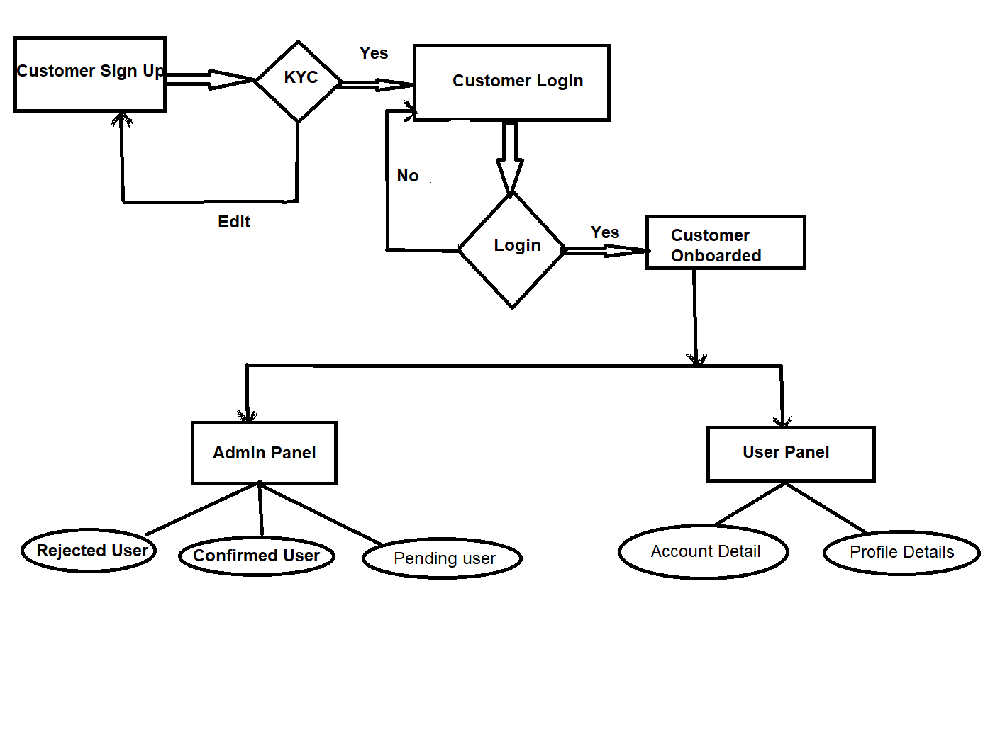

# Coding Assignment - Online Banking

## Tech Stack
- Project Type - Maven
- Backend - Java 1.8, Spring Boot
- Frontend - HTML, CSS, JSP
- Database - H2 

## Tools
- Eclipse
- H2 Console

## 🍳 FlowChart


# 👟 Project Setup

```text
- Clone and import project as Maven in eclipse
- Open UserFrontApplication.java and Run as Java application
- Open Database Console: http://localhost:8080/h2-ui
- Open Login Page: http://localhost:8080/index
```

**Super User password**

```python
User ID: admin@123
password: 123
```
